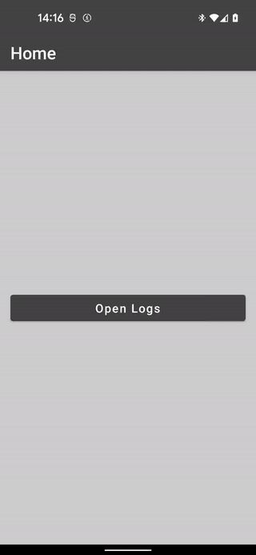

# Lifecycle Aware ViewModel

This is an alternative for [Restartable Lifecycle-aware coroutines](https://developer.android.com/topic/libraries/architecture/coroutines#restart)

I wanted to share a simpler approach to launching tasks in ViewModel based on changes in the lifecycle.

I also included ViewParam util which is useful for delivering screen launch arguments to ViewModel.

## Releases

Current releases can be found at [https://github.com/AdamKobus/lifecycle-aware-viewmodel/releases](https://github.com/AdamKobus/lifecycle-aware-viewmodel/releases)

```groovy
repositories {
    mavenCentral()
}

dependencies {
    // LifecycleObserverKtx
    implementation "com.adamkobus:lifecycle-observer-ktx:1.0.2"
    
    // LifecycleObserverKtx + LifecycleAwareViewModel + ViewParam
    implementation "com.adamkobus:lifecycle-observer-viewmodel-ktx:1.0.2"
}
```

## Snapshots

You can find current releases at Sonatype Snapshots Repository:

- [lifecycle-observer-ktx](https://s01.oss.sonatype.org/content/repositories/snapshots/com/adamkobus/lifecycle-observer-ktx/)

- [lifecycle-observer-viewmodel-ktx](https://s01.oss.sonatype.org/content/repositories/snapshots/com/adamkobus/lifecycle-observer-viewmodel-ktx/)

```groovy
repositories {
    maven { url "https://s01.oss.sonatype.org/content/repositories/snapshots/" }
}

dependencies {
    // LifecycleObserverKtx
    implementation "com.adamkobus:lifecycle-observer-ktx:1.0.2-SNAPSHOT"

    // LifecycleObserverKtx + LifecycleAwareViewModel + ViewParam
    implementation "com.adamkobus:lifecycle-observer-viewmodel-ktx:1.0.2-SNAPSHOT"
}
```

## Demo app



## Links

- [Example usage of LifecycleAwareViewModel](demo/src/main/java/com/adamkobus/android/vm/demo/ui/logs/LogsScreenVM.kt)
  
- [Example usage of ViewParam in ViewModel](demo/src/main/java/com/adamkobus/android/vm/demo/ui/dialog/DemoDialogVM.kt) and
  [binding in screen](demo/src/main/java/com/adamkobus/android/vm/demo/ui/dialog/DemoDialog.kt)

# License

```text
MIT License

Copyright (c) 2022 Adam Kobus

Permission is hereby granted, free of charge, to any person obtaining a copy
of this software and associated documentation files (the "Software"), to deal
in the Software without restriction, including without limitation the rights
to use, copy, modify, merge, publish, distribute, sublicense, and/or sell
copies of the Software, and to permit persons to whom the Software is
furnished to do so, subject to the following conditions:

The above copyright notice and this permission notice shall be included in all
copies or substantial portions of the Software.

THE SOFTWARE IS PROVIDED "AS IS", WITHOUT WARRANTY OF ANY KIND, EXPRESS OR
IMPLIED, INCLUDING BUT NOT LIMITED TO THE WARRANTIES OF MERCHANTABILITY,
FITNESS FOR A PARTICULAR PURPOSE AND NONINFRINGEMENT. IN NO EVENT SHALL THE
AUTHORS OR COPYRIGHT HOLDERS BE LIABLE FOR ANY CLAIM, DAMAGES OR OTHER
LIABILITY, WHETHER IN AN ACTION OF CONTRACT, TORT OR OTHERWISE, ARISING FROM,
OUT OF OR IN CONNECTION WITH THE SOFTWARE OR THE USE OR OTHER DEALINGS IN THE
SOFTWARE.
```
